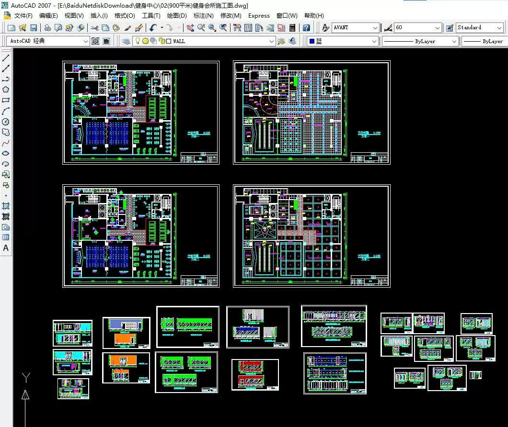
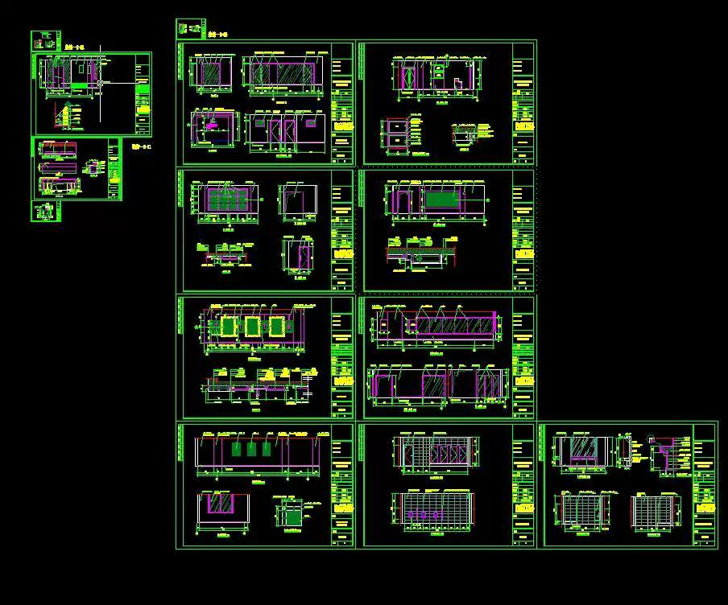
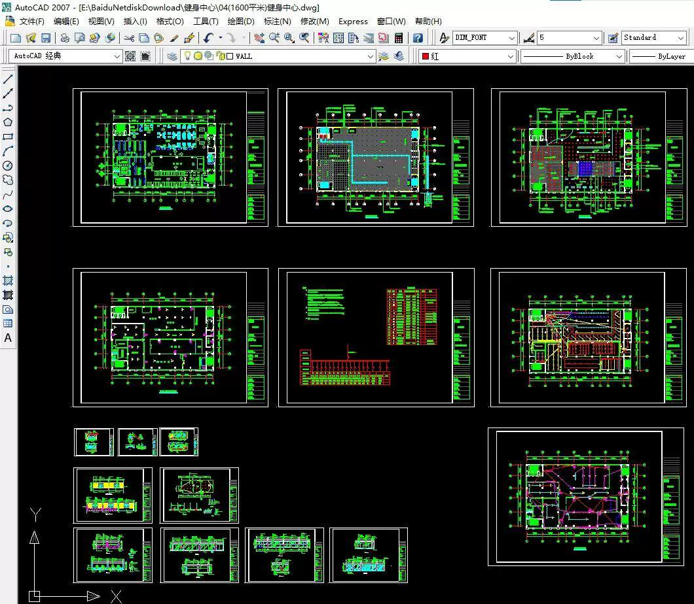
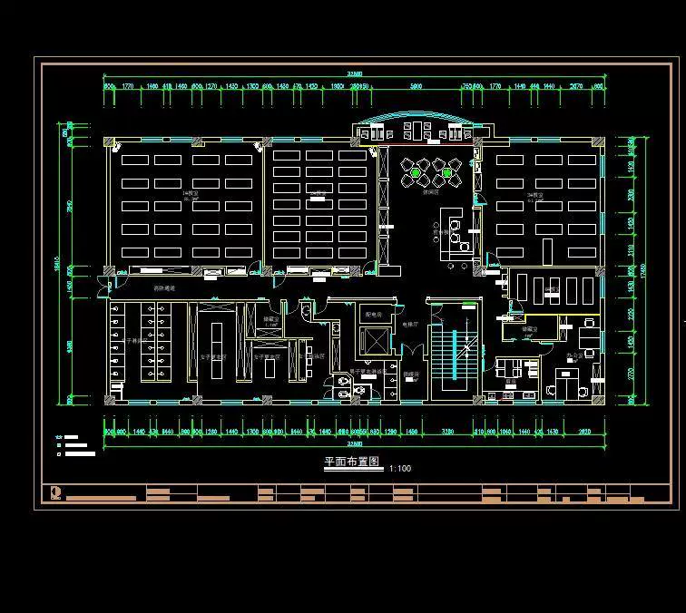
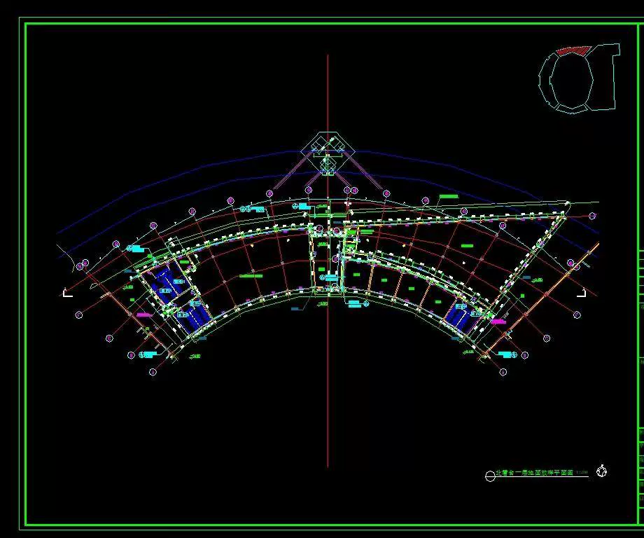
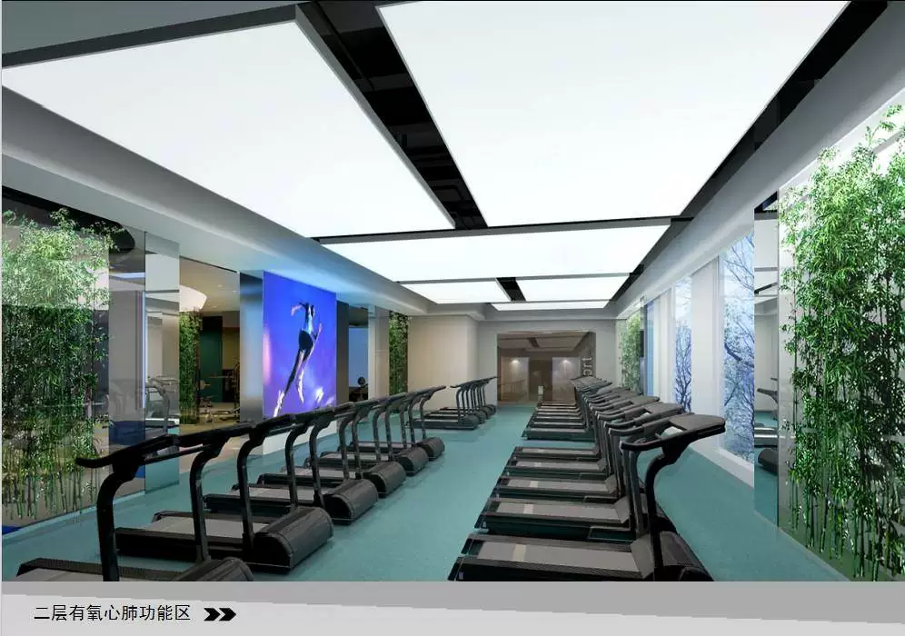
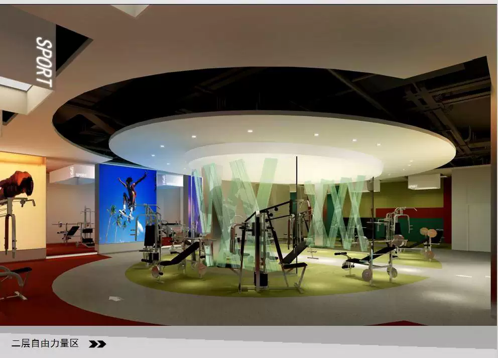

# The CAD construction drawings of fitness center, yoga studio and bowling alley.

## Body

Fitness Center Yoga Studio Bowling Alley CAD Construction Plan Design Materials Floor Plan Engineering Plan 64
Fitness Center Yoga Studio Bowling Alley CAD Construction Plan Design Materials Floor Plan Engineering Plan 64
Fitness Center Yoga Studio Bowling Alley CAD Construction Plan Design Materials Floor Plan Engineering Plan 64

Fitness Center Yoga Studio Bowling Alley CAD Construction Plan Design Materials Floor Plan Engineering Plan 64

**Professional CAD Drawing Material Collection**:

* **Included Types**:
 * Complete CAD drawings (Plan/Construction) for Fitness Center/Gym Clubs
 * Complete CAD drawings (Plan/Construction) for Yoga Studios
 * Complete CAD drawings (Plan/Construction) for Bowling Alleys
 * Sports Gym Decoration Design Plans
 * Sports Exhibition Center Engineering Drawings

* **File Format**: CAD drawing files (Supported by AutoCAD 2007 and above versions for opening and editing)
* **Purpose**: Design reference, construction guidance, reference, learning materials.

**Note**: This material is an electronic version of CAD drawing files, which will be provided with a download link after purchase.

## Images

## Payment

Here is a pay link on Stripe ( https://buy.stripe.com/3cs8yP7sY87d0vu9AB ). Please contact me lonlonago@foxmail.com after funding $89, and I will send you a complete data files , thank you!

